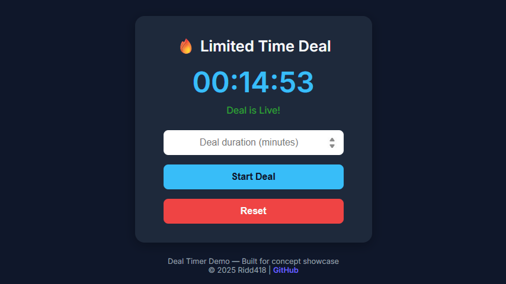

# Deal Timer ⏳

## Overview
A modern **deal countdown timer** built with **HTML, CSS, and Vanilla JavaScript**, designed to persist accurately across page reloads using `localStorage`.

This project emphasizes **clean architecture**, **modular JavaScript with ES modules**, and a simple, focused UI for demonstrating time-based deal logic commonly used in e-commerce and promotions.

---

## 🎯 Features

- **Configurable Deal Duration** – Set the deal length in minutes  
- **Persistent Countdown** – Timer survives page reloads and browser refreshes  
- **Live Status Updates** – Clear visual states: *Not Started*, *Live*, *Deal Over*  
- **Accurate Time Tracking** – Based on timestamps, not intervals  
- **Reset Control** – Restart the deal and clear stored state  
- **Modern UI** – Clean, responsive layout with accessible contrast  

---

## 🖥️ Demo

Check out the live demo:
<a href="https://ridd418.github.io/deal-timer/" target="_blank" rel="noopener noreferrer">
  Live Demo
</a>

---

## 🧠 How It Works

Instead of relying on an in-memory countdown, the app stores **when the deal started** and **how long it lasts**.

### Stored State (`localStorage`)
```js
{
  start: Date.now(),      // timestamp in milliseconds
  duration: seconds      // total deal duration
}
```

### On Page Load
```js
secondsPassed = now - start
secondsLeft   = duration - secondsPassed
```

- If `secondsLeft > 0` → resume countdown  
- If `secondsLeft <= 0` → mark deal as over  

This ensures the timer remains accurate even if the tab is closed or refreshed.

> Note: There is slight drift of less than a second for the timer to resume after page reload, which is normally negligible under normal circumstances.

---

## 🧩 Architecture

The project is intentionally split into focused modules:

- **`script.js`** – App orchestration, UI updates, and event handling  
- **`timer.js`** – Reusable countdown timer logic (no DOM dependency)  
- **`stateStore.js`** – Persistent storage abstraction using `localStorage`  

This separation keeps logic testable, reusable, and easy to extend.

---

## 💡 Use Cases

- Flash sales / limited-time offers  
- E-commerce deal banners  
- Marketing countdowns  
- JavaScript architecture demos  

---

## 🛠️ Tech Stack

- **HTML5**
- **CSS3** (modern variables, responsive layout)
- **JavaScript (ES6+ Modules)**

No frameworks. No build step. Just clean, modern web fundamentals.

---

## 📂 Installation

1. Clone the repository:

    ```bash
    git clone https://github.com/ridd418/deal-timer.git
    cd deal-timer
    ```

2. Install `Docker` and `Docker Compose` if not already installed

3. Deploy using docker (from the project folder):

    ```bash
    docker compose up -d
    ```

4. Open `http://localhost:4000/` in your browser.

That's it!

Tip: You can change the host `port` map in the the `compose.yaml` to what ever you like.

Example:

```yaml
    ports:
      - "<your port here>:80"
```

**Clean up:**

```bash
docker compose down
```

---

## 📸 Screenshot



---

## 📝 License

This project is licensed under the **MIT License**.  
See [LICENSE](LICENSE) for details.
